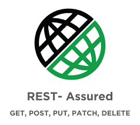

<!-- Logo 4noobs -->

  

<!-- Title -->

  <h2 align="center">RESTassured4Noobs</h2>

  <h1 align="center"></h1>

  

     
    <a href="#ROADMAP"><strong>Explore a documentação »</strong></a>
     
     
    <a href="https://github.com/joaopedro17/restassured4noobs/issues">Report Bug</a>
    ·
    <a href="https://github.com/joaopedro17/restassured4noobs/issues">Request Feature</a>
  

<!-- ABOUT THE PROJECT -->

## Sobre o Projeto

O **RESTassured4Noobs** é um guia introdutório para quem quer aprender a testar APIs REST usando o [REST-assured](https://rest-assured.io/), uma biblioteca Java que simplifica a validação de serviços REST com sintaxe BDD (Given/When/Then).

Ideal para desenvolvedores e QAs que já conhecem Java e querem automatizar testes de API de forma elegante e produtiva.

<!-- ROADMAP OF PROJECT -->

## ROADMAP

- Módulo 1 - Introdução
  - [Boas-vindas](1-Introducao/1-Boas-vindas.md)
  - [Comunicação](1-Introducao/2-Comunicacao.md)
- Módulo 2 - Ambiente
  - [macOS](2-Ambiente/1-Ambiente-macos.md)
  - [Windows](2-Ambiente/2-Ambiente-windows.md)
  - [Linux](2-Ambiente/3-Ambiente-linux.md)
  - [Editor e Início](2-Ambiente/4-Editor-e-inicio.md)
  - [Dicas Gerais](2-Ambiente/5-Dicas-gerais.md)
- Módulo 3 - Básico
  - [Verbos HTTP](3-Basico/1-Verbos-HTTP.md)
  - [Parâmetros e Headers](3-Basico/2-Parametros-e-Headers.md)
  - [Assertions](3-Basico/3-Assertions.md)
  - [Primeiro Teste](3-Basico/4-Primeiro-teste.md)
- Módulo 4 - Intermediário
  - [Autenticação](4-Intermediario/1-Autenticacao.md)
  - [Serialização](4-Intermediario/2-Serializacao.md)
  - [Especificações](4-Intermediario/3-Especificacoes.md)
  - [Logging](4-Intermediario/4-Logging.md)
  - [API Object Pattern](4-Intermediario/5-API-object.md)
- Módulo 5 - Avançado
  - [BDD com Cucumber](5-Avancado/1-BDD-Cucumber.md)
  - [Testes de Contrato](5-Avancado/2-Testes-de-contrato.md)
  - [CI/CD](5-Avancado/3-CI-CD.md)
  - [Relatórios](5-Avancado/4-Relatorios.md)

<!-- CONTRIBUTING -->

## Como Contribuir

Contribuições fazem com que a comunidade open source seja um lugar incrível para aprender, inspirar e criar. Todas contribuições
são **extremamente apreciadas**

1. Realize um Fork do projeto
2. Crie um branch com a nova feature (`git checkout -b feature/featureBraba`)
3. Realize o Commit (`git commit -m 'Adicionado conteudo brabo'`)
4. Realize o Push no Branch (`git push origin feature/featureBraba`)
5. Abra um Pull Request

## Autores

- **João Pedro** - _Autor_ - [@joaopedro17](https://github.com/joaopedro17)

---

  

